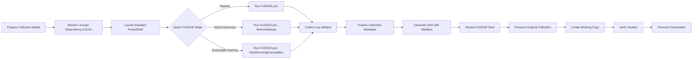

<div align="center">

# 🦅 FLEDGE

### Forensic Live Evidence Data Gathering Engine

**A PowerShell-based forensic live-response collection framework for Windows systems**

<br>


<br>

> **Structured live-response acquisition of volatile, system, user, process, persistence, file, and network artifacts from Windows environments.**

</div>

---

## 🔎 Overview

**FLEDGE** — the **Forensic Live Evidence Data Gathering Engine** — is a PowerShell-based forensic collection project designed to support structured acquisition of volatile and system-level artifacts from live Windows environments.

FLEDGE prioritizes volatile information early in the collection process and organizes acquired artifacts into a timestamped evidence directory for subsequent forensic review.

The objective is simple:

> **Collect useful point-in-time evidence while maintaining a clear, repeatable, and integrity-verifiable acquisition structure.**

By default, FLEDGE performs a **passive live-response collection**.

Active network discovery is optional and must be explicitly enabled by the examiner.

---

## 🪺 The FLEDGE Nest

<div align="center">

### You'll find all acquired data **Nested** in the root of your prepared collection drive.

</div>

Each execution creates a timestamped directory:

```text
FLEDGE_Nest_YYYYMMDD_HHMMSS
```

Example:

```text
FLEDGE_Nest_20260907_125900
```

The resulting collection is organized approximately as follows:

```text
FLEDGE_Nest_YYYYMMDD_HHMMSS
│
├── System
│   ├── collection_metadata_YYYYMMDD_HHMMSS.txt
│   ├── time_information_YYYYMMDD_HHMMSS.txt
│   ├── computer_info_YYYYMMDD_HHMMSS.txt
│   ├── systeminfo_native_YYYYMMDD_HHMMSS.txt
│   └── open_files_YYYYMMDD_HHMMSS.txt
│
├── Processes
│   ├── tasklist_YYYYMMDD_HHMMSS.txt
│   ├── pslist_YYYYMMDD_HHMMSS.txt
│   ├── process_details_YYYYMMDD_HHMMSS.csv
│   └── running_executable_hashes_YYYYMMDD_HHMMSS.csv
│
├── Network
│   ├── tcp_connections_YYYYMMDD_HHMMSS.csv
│   ├── tcp_listeners_YYYYMMDD_HHMMSS.csv
│   ├── udp_endpoints_YYYYMMDD_HHMMSS.csv
│   ├── tcp_process_mapping_YYYYMMDD_HHMMSS.csv
│   ├── udp_process_mapping_YYYYMMDD_HHMMSS.csv
│   ├── dns_cache_YYYYMMDD_HHMMSS.csv
│   ├── neighbor_cache_pre_YYYYMMDD_HHMMSS.csv
│   ├── arp_native_pre_YYYYMMDD_HHMMSS.txt
│   ├── route_table_YYYYMMDD_HHMMSS.csv
│   ├── route_print_YYYYMMDD_HHMMSS.txt
│   ├── default_gateway_YYYYMMDD_HHMMSS.csv
│   ├── net_ip_configuration_YYYYMMDD_HHMMSS.txt
│   ├── network_adapters_YYYYMMDD_HHMMSS.csv
│   ├── ip_addresses_YYYYMMDD_HHMMSS.csv
│   ├── ipconfig_all_YYYYMMDD_HHMMSS.txt
│   ├── router_ping_YYYYMMDD_HHMMSS.txt
│   ├── active_network_sweep_YYYYMMDD_HHMMSS.csv
│   ├── neighbor_cache_post_YYYYMMDD_HHMMSS.csv
│   └── arp_native_post_YYYYMMDD_HHMMSS.txt
│
├── Users
│   ├── psloggedon_YYYYMMDD_HHMMSS.txt
│   ├── quser_YYYYMMDD_HHMMSS.txt
│   └── qwinsta_YYYYMMDD_HHMMSS.txt
│
├── Services
│   ├── services_YYYYMMDD_HHMMSS.csv
│   └── psservice_YYYYMMDD_HHMMSS.txt
│
├── Persistence
│   ├── scheduled_tasks_YYYYMMDD_HHMMSS.csv
│   └── registry_run_keys_YYYYMMDD_HHMMSS.csv
│
├── WiFi
│   ├── wifi_interfaces_YYYYMMDD_HHMMSS.txt
│   ├── wifi_networks_YYYYMMDD_HHMMSS.txt
│   ├── wifi_profiles_YYYYMMDD_HHMMSS.txt
│   └── wifi_drivers_YYYYMMDD_HHMMSS.txt
│
├── Logs
│   └── FLEDGE_collection_YYYYMMDD_HHMMSS.log
│
└── Hashes
    ├── collector_hashes_SHA256_YYYYMMDD_HHMMSS.csv
    ├── evidence_hashes_SHA256_YYYYMMDD_HHMMSS.csv
    └── evidence_manifest_SHA256_YYYYMMDD_HHMMSS.txt
```

> [!NOTE]
> Some files are created only when the associated collection option is enabled or when the artifact is available on the target system.

The FLEDGE Nest assists with:

* 🗂️ **Collection organization**
* 🕒 **Point-in-time documentation**
* 🔍 **Subsequent forensic examination**
* 🔐 **Evidence-integrity verification**
* 🧾 **Collector and dependency verification**
* 📝 **Reporting and case documentation**
* ⚠️ **Collection error and limitation tracking**

---

# 🚀 Running FLEDGE

## Basic Requirements

Before execution:

1. Place or the ability to run `FLEDGE.ps1` on the prepared collection media or targeted Windows environment.
2. Ensure the `Dependencies` directory is located beside the script.
3. Accept applicable dependency EULAs before field use.
4. Open PowerShell with administrative privileges when authorized.
5. Navigate to the FLEDGE directory.
6. Execute the desired collection mode.

Example:

```powershell
cd E:\FLEDGE
```

---

## 🟢 Standard Passive Collection

The recommended default execution is:

```powershell
.\FLEDGE.ps1
```

This is a one-time policy exception for systems with scripts disabled (default)
```powershell
powershell.exe -NoProfile -ExecutionPolicy Bypass -File .\FLEDGE.ps1
```

This performs a **passive live-response collection** and does not intentionally conduct active host discovery.

The standard collection includes the following artifacts:

* Collection metadata
* Local and UTC system time
* Time-zone information
* Logged-on users
* Interactive sessions
* Running processes
* Process command lines
* Parent/child process identifiers
* TCP connections
* TCP listeners
* UDP endpoints
* Process-to-network mappings
* DNS cache
* ARP / neighbor cache
* Routing information
* Default gateway
* Network interfaces
* IP configuration
* Open files
* Services
* Scheduled tasks
* Common registry Run / RunOnce persistence locations
* Wi-Fi information
* General system information
* Collector and dependency hashes
* Evidence SHA-256 manifest

> [!TIP]
> Passive collection should generally be preferred when the investigative objective does not require active network enumeration.

---

## 🌐 Active Network Discovery

To enable active network discovery:

```powershell
.\FLEDGE.ps1 -NetworkSweep
```

This performs the standard FLEDGE collection and additionally conducts active network operations including:

```text
Default Gateway Ping
        │
        ▼
ICMP Host Discovery
        │
        ▼
Post-Sweep ARP / Neighbor Collection
```

FLEDGE captures the ARP / neighbor cache **before** active discovery and again **after** the network sweep.

This allows an examiner to distinguish between neighbor information already present on the system and entries that may have been populated during active discovery.

> [!WARNING]
> `-NetworkSweep` generates network traffic and can modify the local ARP / neighbor cache.
>
> It may also generate logs or alerts on network infrastructure, firewalls, endpoints, IDS/IPS systems, or other monitoring platforms.

Active network discovery should therefore only be used when it is within the scope and authority of the examination.

### Current Network-Sweep Safety Behavior

FLEDGE currently performs automatic host enumeration only when the primary IPv4 interface uses a `/24` prefix:

```text
/24
```

For example:

```text
192.168.1.0/24
```

If the identified interface uses another prefix length, FLEDGE records the condition and skips automatic subnet enumeration rather than assuming an incorrect address range.

---

## 🔐 Hash Running Executables

To calculate SHA-256 hashes for executable files associated with running processes:

```powershell
.\FLEDGE.ps1 -HashRunningExecutables
```

This creates:

```text
Processes\
└── running_executable_hashes_YYYYMMDD_HHMMSS.csv
```

The output may include information such as:

```text
Executable Path
File Size
Last Write Time
SHA-256
Hash Status
```

> [!NOTE]
> This option causes additional disk reads because FLEDGE must access executable files to calculate their cryptographic hashes.

For that reason, executable hashing is optional rather than part of the default acquisition. Consider a forensics image of the target drive, as needed.

---

## 🔎 Active Discovery + Executable Hashing

Multiple modes (switches) can be enabled together:

```powershell
.\FLEDGE.ps1 -NetworkSweep -HashRunningExecutables
```

This performs:

```text
Standard Passive Collection
          +
Running Executable SHA-256 Hashing
          +
Active Network Discovery
```

---

## 🧭 FLEDGE Command Reference

| Command                                              | Behavior                                                               |
| ---------------------------------------------------- | ---------------------------------------------------------------------- |
| `.\FLEDGE.ps1`                                       | Standard passive live-response collection                              |
| `.\FLEDGE.ps1 -NetworkSweep`                         | Passive collection + active network discovery                          |
| `.\FLEDGE.ps1 -HashRunningExecutables`               | Passive collection + SHA-256 hashing of accessible running executables |
| `.\FLEDGE.ps1 -NetworkSweep -HashRunningExecutables` | Enables both optional collection modes                                 |

---

## ⚠️ Before Executing FLEDGE

> [!IMPORTANT]
> **FLEDGE is intended for authorized forensic, incident-response, investigative, security-research, training, and academic use only.**

### 1. Accept Dependency EULAs

FLEDGE may use Microsoft Sysinternals utilities located within the:

```text
Dependencies
```

directory.

Current dependencies may include:

```text
pslist.exe
psservice.exe
psfile.exe
psloggedon.exe
```

Before operational use, review and accept all applicable dependency license agreements.

> [!WARNING]
> Dependency EULAs should normally be reviewed and accepted **before arriving at the target system** whenever operationally appropriate.

FLEDGE also validates whether expected dependencies are present before acquisition and records missing dependencies in the collection log.

A missing dependency will not terminate the entire collection but omit those requiring the dependency.

---

### 2. Run With Elevated Privileges

FLEDGE should normally be executed from an **elevated PowerShell session**.

```text
PowerShell
└── Run as Administrator
```

Administrative privileges may be required to fully access certain Artifacts:

* Processes
* Executable paths
* Services
* Open files
* Network information
* User sessions
* System information
* Persistence artifacts

FLEDGE detects whether the current session has elevated privileges and records the result in the collection metadata.

If FLEDGE is not elevated, collection continues where possible.

> [!NOTE]
> A non-administrative collection may contain incomplete artifacts.

---

### 3. Enable Windows Location Services When Required

Some Windows WLAN commands require access to **Location Services** before nearby wireless network information can be queried.

If WLAN information is required:

```text
Settings
   └── Privacy & security
       └── Location
           └── Location services → On
```

Without this permission, wireless collection commands may return incomplete results or access errors.

FLEDGE will not automatically enable Location Services.

---

### 4. Minimize Examiner-Generated Activity

Live acquisition inevitably interacts with the operating system being examined.

Whenever operationally appropriate, minimize unnecessary examiner activity before and during acquisition.

Examples include:

* Cloud synchronization
* Automatic updates
* Personal mobile devices
* Streaming services
* Unnecessary browser sessions
* Background applications
* Unnecessary external devices
* Additional commands unrelated to the examination

> [!TIP]
> Reducing investigator-generated activity can make subsequent interpretation of volatile artifacts easier.

---

## ⏱️ Collection Order

FLEDGE prioritizes relatively volatile information before slower or more persistent artifacts.

The collection sequence is approximately:

```text
┌──────────────────────────────────────────────┐
│        RECOMMENDED FLEDGE COLLECTION         │
├──────────────────────────────────────────────┤
│  01. Collection Metadata / System Time       │
│  02. Logged-On Users / Sessions              │
│  03. Running Processes                       │
│  04. TCP Connections / Listeners             │
│  05. UDP Endpoints                           │
│  06. Network-to-Process Mapping              │
│  07. DNS Cache                               │
│  08. ARP / Neighbor Cache                    │
│  09. Routing / Default Gateway               │
│  10. Network Interface Configuration         │
│  11. Open Files                              │
│  12. Services                                │
│  13. Scheduled Tasks / Persistence           │
│  14. Wi-Fi Information                      │
│  15. General System Information              │
│  16. Optional Executable Hashing             │
│  17. Optional Active Network Discovery       │
│  18. Collector / Dependency Hashes           │
│  19. Final Collection Metadata               │
│  20. Evidence SHA-256 Manifest               │
└──────────────────────────────────────────────┘
```

This sequence is intended to capture highly transient information before performing slower collection tasks such as comprehensive system-information queries.

---

## ⚡ Volatile Evidence Collection

FLEDGE prioritizes artifacts that can change rapidly while a Windows system remains operational.

Examples include:

| Artifact                | Forensic Value                                     |
| ----------------------- | -------------------------------------------------- |
| 👤 Logged-on users      | Current user and session state                     |
| ⚙️ Running processes    | Active programs and process identifiers            |
| 🌳 Parent Process IDs   | Basic process ancestry                             |
| 💬 Command lines        | Process execution context and arguments            |
| 🌐 TCP connections      | Active network communications                      |
| 🔌 Listening ports      | Locally exposed network services                   |
| 📡 UDP endpoints        | Active UDP sockets                                 |
| 🧠 DNS cache            | Recently resolved network names                    |
| 🔗 ARP / neighbor cache | Recently observed local network neighbors          |
| 📂 Open files           | Files currently referenced by the operating system |

Because these artifacts are volatile:

> **The FLEDGE output represents a point-in-time observation of system state.**

Values may change immediately after collection.

---

## 🌐 Live Network Collection

FLEDGE collects multiple complementary views of Windows networking state.

```text
┌───────────────────────────────────────────────┐
│             LIVE NETWORK SNAPSHOT             │
├───────────────────────────────────────────────┤
│  Default Gateway                              │
│  IPv4 / IPv6 Configuration                    │
│  Network Adapters                             │
│  Routing Table                                │
│  ARP / Neighbor Cache                         │
│  DNS Client Cache                             │
│  TCP Connections                              │
│  TCP Listening Ports                          │
│  UDP Endpoints                                │
│  Process-to-Network Mapping                   │
│  Wireless Interface Information               │
│  Nearby Wireless Networks                     │
│  Stored Wireless Profiles                     │
│                                               │
│  Optional:                                    │
│  ICMP Gateway Test                            │
│  Active /24 Host Discovery                    │
└───────────────────────────────────────────────┘
```

Where useful, FLEDGE exports networking artifacts as structured CSV files rather than relying solely on formatted console output.

This allows collected information to be:

* Sorted
* Filtered
* Imported into forensic tools
* Parsed programmatically
* Compared across acquisitions
* Incorporated into timelines or investigative analysis

---

## ⚙️ Process Collection

FLEDGE collects multiple process views to provide both examiner-readable and structured information.

Process artifacts can include:

```text
Process ID
Parent Process ID
Process Name
Executable Path
Command Line
Creation Time
Session ID
Handle Count
Thread Count
```

This information can assist with identification of:

* Suspicious PowerShell activity
* Command-shell execution
* Script interpreters
* LOLBins
* Unexpected executable locations
* Process ancestry
* Network-connected processes
* Unusual execution arguments

FLEDGE also maps TCP and UDP activity back to process identifiers where available.

---

## 🧬 Persistence Collection

FLEDGE includes lightweight collection of common Windows persistence mechanisms.

Current collection includes:

### Scheduled Tasks

```text
Task Name
Task Path
State
Author
Description
Actions
Triggers
User
Run Level
```

### Registry Run Keys

FLEDGE checks commonly used locations including:

```text
HKLM\SOFTWARE\Microsoft\Windows\CurrentVersion\Run
HKLM\SOFTWARE\Microsoft\Windows\CurrentVersion\RunOnce

HKLM\SOFTWARE\WOW6432Node\Microsoft\Windows\CurrentVersion\Run
HKLM\SOFTWARE\WOW6432Node\Microsoft\Windows\CurrentVersion\RunOnce

HKCU\SOFTWARE\Microsoft\Windows\CurrentVersion\Run
HKCU\SOFTWARE\Microsoft\Windows\CurrentVersion\RunOnce
```

These artifacts should be treated as triage information rather than a comprehensive persistence examination.

---

## 🖥️ Live Host Collection

FLEDGE assists with collection of live system-state information including:

| Artifact Category      | Examples                                                   |
| ---------------------- | ---------------------------------------------------------- |
| 🕒 **Time**            | Local time, UTC time, time zone, Windows Time state        |
| 🖥️ **System**         | OS, hostname, hardware, Windows configuration              |
| 👤 **Users**           | Logged-on users and interactive sessions                   |
| ⚙️ **Processes**       | PID, PPID, command lines, executable paths                 |
| 📂 **Files**           | Open files                                                 |
| 🌐 **Network**         | Interfaces, routes, connections, DNS, ARP                  |
| 🔌 **Services**        | Service state, startup mode, account, executable path      |
| 🧬 **Persistence**     | Scheduled tasks and common Run keys                        |
| 📡 **Wi-Fi**           | Interface, BSSID/SSID observations, profiles, drivers      |
| 🧾 **Collection Logs** | Start, completion, failures, warnings                      |
| 🔐 **Integrity**       | SHA-256 manifests and collector hashes                     |
| 🧠 **Volatile State**  | Information that may disappear or change after acquisition |

---

## 📝 Collection Logging

FLEDGE records collection activity in:

```text
Logs\
└── FLEDGE_collection_YYYYMMDD_HHMMSS.log
```

The log records events such as:

```text
Collector started
Collector completed
Collection duration
Dependency availability
Access errors
Collection failures
Warnings
Network-sweep state
Administrative privilege state
```

Individual collector failures are designed to be documented without unnecessarily terminating the entire acquisition.

The intended behavior is:

> **Collect what is available, document what is not, and continue acquisition whenever possible.**

---

## 🧾 Collection Metadata

FLEDGE records acquisition context in:

```text
System\
└── collection_metadata_YYYYMMDD_HHMMSS.txt
```

Metadata may include:

```text
FLEDGE Version
Collection Start - Local
Collection Start - UTC
Collection End - Local
Collection End - UTC
Collection Duration
Computer Name
Domain
Current User
Administrative Privilege State
PowerShell Version
PowerShell Edition
Script Path
Output Directory
Network Sweep Enabled
Running Executable Hashing Enabled
```

This information assists with subsequent reporting and reconstruction of collection circumstances.

---

## 🔐 Evidence Integrity

FLEDGE automatically generates SHA-256 hashes for collected artifacts at the end of acquisition.

The primary evidence manifest is stored in:

```text
Hashes\
└── evidence_hashes_SHA256_YYYYMMDD_HHMMSS.csv
```

The manifest contains information such as:

```text
File Name
Relative Path
File Length
SHA-256
```

Relative paths are included so the manifest remains useful after the FLEDGE Nest is transferred to another forensic storage location.

---

### Hash Manifest Integrity

After the evidence manifest is completed, FLEDGE calculates the SHA-256 value of the manifest itself.

That value is stored in:

```text
Hashes\
└── evidence_manifest_SHA256_YYYYMMDD_HHMMSS.txt
```

---

### Collector Integrity

FLEDGE separately hashes the collector and available dependency binaries.

```text
Hashes\
└── collector_hashes_SHA256_YYYYMMDD_HHMMSS.csv
```

This can include:

```text
FLEDGE.ps1
pslist.exe
psservice.exe
psfile.exe
psloggedon.exe
```

This assists with documenting which version of the collector and supporting utilities were used during acquisition.

---

## 🔄 Evidence Handling

> [!CAUTION]
> **Collected evidence should be verified before analysis and after subsequent copying.**

A recommended workflow is:

```text
ACQUIRE
   │
   ▼
HASH
   │
   ▼
PRESERVE ORIGINAL
   │
   ▼
CREATE FORENSIC / WORKING COPY
   │
   ▼
REHASH
   │
   ▼
VERIFY
   │
   ▼
ANALYZE
```

Example independent verification:

```powershell
Get-FileHash .\EvidenceFile.bin -Algorithm SHA256
```

For a FLEDGE Nest, compare the resulting files against:

```text
evidence_hashes_SHA256_YYYYMMDD_HHMMSS.csv
```

> **Acquisition → Hash → Copy → Rehash → Verify**

---

## 📝 Example Report Language — Passive Collection

The following is an example of how a standard FLEDGE collection could be described in an investigative or forensic report:

> A live forensic survey of the Windows system was conducted using the Forensic Live Evidence Data Gathering Engine (FLEDGE), PowerShell, native Windows utilities, and Microsoft Sysinternals utilities. The collection captured point-in-time system information including system time, logged-on users, active sessions, running processes, process command lines and identifiers, TCP and UDP network information, DNS cache data, ARP and neighbor information, routing information, open files, services, selected persistence artifacts, and wireless configuration information. The resulting artifacts were organized within a timestamped FLEDGE collection directory and SHA-256 hash values were generated to support subsequent integrity verification.

---

## 📝 Example Report Language — Active Network Discovery

If `-NetworkSweep` was used, report language should clearly identify that active network interaction occurred.

Example:

> A live forensic survey of the Windows system was conducted using the Forensic Live Evidence Data Gathering Engine (FLEDGE), PowerShell, native Windows utilities, and Microsoft Sysinternals utilities. Prior to active network discovery, the system's ARP and neighbor information was collected. FLEDGE was then configured to conduct authorized active network discovery using ICMP communications against the identified /24 network. Following active discovery, ARP and neighbor information was collected again to document network entries observed after the sweep. The resulting information represents a point-in-time snapshot of system and network state at the time of collection.

> [!NOTE]
> Report language should always be modified to accurately describe the **specific commands, options, tools, artifacts, results, limitations, errors, and investigative circumstances** associated with the examination.

---

## 🧭 Recommended Collection Workflow



---

## ⚠️ Collection Considerations

Live forensic collection is inherently intrusive to some degree.

Running commands may:

* Create process activity
* Consume memory
* Access files
* Generate system events
* Update access-related metadata
* Interact with Windows services
* Cause additional disk reads
* Modify transient operating-system state

The optional network sweep may additionally:

* Generate ICMP traffic
* Populate ARP / neighbor entries
* Cause network-device logging
* Trigger firewall or IDS/IPS alerts
* Interact with remote systems

These effects should be considered when determining whether live-response collection is appropriate for a particular examination.

---

## ⚖️ Authorized Use Only

FLEDGE is designed for legitimate:

* Digital forensics
* Incident response
* Cyber investigations
* Security research
* Laboratory testing
* Training
* Academic use

Users are responsible for confirming that they possess all required:

* Legal authority
* Consent
* Organizational approval
* Search authority
* Warrants
* Policies
* Rules of engagement
* Other applicable authorization

before collecting data from a system or network.

---

## 📜 Legal Notice

> [!WARNING]
> **FLEDGE is provided for legitimate DFIR, investigative, security-research, training, and academic purposes only.**
>
> Users are solely responsible for ensuring they possess the necessary legal authority and authorization before using FLEDGE against any computer system, storage device, account, or network.
>
> The author assumes no responsibility or liability for misuse, unauthorized use, improper collection, evidentiary handling, operational impact, data loss, network impact, or violations of applicable law, policy, regulation, or organizational requirements resulting from use of this software.

---

## 🦅 Quick Reference

```powershell
# Standard passive live-response collection
.\FLEDGE.ps1

# Passive collection + active network discovery
.\FLEDGE.ps1 -NetworkSweep

# Passive collection + hash accessible running executables
.\FLEDGE.ps1 -HashRunningExecutables

# Enable both optional modes
.\FLEDGE.ps1 -NetworkSweep -HashRunningExecutables
```

---

<div align="center">

### 🦅 FLEDGE

**Forensic Live Evidence Data Gathering Engine**

`COLLECT • NEST • HASH • VERIFY • ANALYZE`

<br>

**Passive by Default • Active When Authorized**

<br>

**For Authorized Use Only**

</div>
