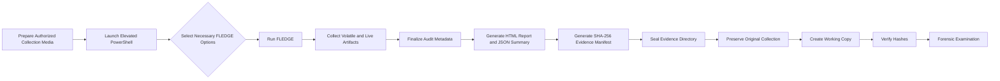

<div align="center">

# 🦅 FLEDGE

### Forensic Live Evidence Data Gathering Engine

**A PowerShell-based forensic live-response collection framework for Windows systems**

<br>


<br>

> **Structured live-response acquisition of volatile, system, user, process, persistence, security, and network artifacts from Windows environments.**

</div>

---

## 🔎 Overview

**FLEDGE** — the **Forensic Live Evidence Data Gathering Engine** — is a PowerShell-based forensic collection framework designed to support structured acquisition of volatile and system-level artifacts from live Windows systems.

FLEDGE prioritizes volatile information early in the acquisition, records collection provenance and collector status, organizes acquired artifacts into a timestamped evidence directory, produces a self-contained HTML review report, and generates SHA-256 manifests to support subsequent integrity verification.

The objective is simple:

> **Collect useful point-in-time evidence while maintaining a clear, repeatable, reviewable, and integrity-verifiable acquisition structure.**

### Design Principles

FLEDGE is designed around the following principles:

* 🟢 **Passive by default**
* ⚠️ **State-changing actions require explicit examiner options**
* 🧠 **Volatile evidence is prioritized**
* 🧾 **Collection provenance and limitations are documented**
* 🔁 **Collectors degrade gracefully when commands or dependencies are unavailable**
* 🔐 **Collector and evidence integrity are documented with SHA-256**
* 🖥️ **A portable offline HTML report provides rapid review**
* 📦 **Machine-readable CSV and JSON output supports downstream analysis**
* 🧪 **Optional capabilities are separated from the standard collection**

---

# 🆕 What's New in v1.2.3

Version **1.2.3** significantly expands FLEDGE while tightening its passive-by-default behavior.

### Reporting

* Professional self-contained HTML report
* Fixed-screen application-style layout
* **Light / Dark mode toggle**
* Overview, Collector Status, and Artifacts tabs
* Searchable artifact inventory
* Clickable artifact paths
* Read-only artifact popup viewer
* Search within opened artifacts
* CSV artifacts displayed as tables with sticky headers
* Text, log, JSON, XML, and PowerShell artifacts displayed in fixed-height scrolling views
* Large CSV previews limited to the first **1,000 records**
* Large text previews limited to approximately **2 MB**
* Offline Content Security Policy preventing external connections or remote resource loading
* Collected HTML is displayed as source rather than executed
* Machine-readable `collection_summary_*.json`

### Forensic Reliability

* Evidence-directory writes stop after evidence sealing
* Final logs and audit files are frozen before report generation
* The HTML report itself is included in the final SHA-256 evidence manifest
* Script and dependency hashes are recorded
* Collector results are exported to `collector_status_*.csv`
* Missing optional capabilities are recorded as **Skipped** instead of incorrectly reported as failures
* Native-command compatibility checks and fallbacks improve operation across Windows environments
* Output to the Windows system drive is detected and documented

### Expanded Collection

* Process owner and SID information
* Parent and grandparent process relationships
* Authenticode signature information
* Executable company/product/version metadata
* DNS client and DNS server configuration
* SMB connections, mappings, sessions, and shares
* WinHTTP and user proxy configuration
* Startup folder contents
* Extended registry persistence locations
* Browser extension inventory
* Office startup locations
* WMI permanent event subscriptions
* PowerShell execution policy and profile information
* PowerShell console history when available
* Microsoft Defender state and detections when available
* BitLocker status when available

### Passive-by-Default Improvements

Nearby Wi-Fi discovery is no longer part of the standard passive acquisition.

It now requires:

```powershell
.\FLEDGE.ps1 -WirelessScan
```

FLEDGE also no longer automatically invokes Sysinternals tools with `-accepteula`.

EULA acceptance must already exist or be explicitly authorized with:

```powershell
.\FLEDGE.ps1 -AcceptPsToolsEula
```

This prevents the standard collection from intentionally writing Sysinternals EULA acceptance state to the examined system.

---

## 🪺 The FLEDGE Nest

Each execution creates a timestamped collection directory:

```text
FLEDGE_Nest_YYYYMMDD_HHMMSS
```

Example:

```text
FLEDGE_Nest_20260928_183540
```

By default, the collection is created beside the FLEDGE script.

For forensic work, an examiner can instead specify authorized external evidence storage:

```powershell
.\FLEDGE.ps1 -OutputPath E:\Evidence
```

This creates:

```text
E:\Evidence\FLEDGE_Nest_YYYYMMDD_HHMMSS
```

> [!IMPORTANT]
> Writing collection output to the examined system necessarily changes system state. When practical and authorized, use `-OutputPath` to direct the collection to prepared external evidence media.

### Collection Structure

The resulting FLEDGE Nest is organized approximately as follows:

```text
FLEDGE_Nest_YYYYMMDD_HHMMSS
│
├── System
│   ├── collection_metadata_YYYYMMDD_HHMMSS.txt
│   ├── time_information_YYYYMMDD_HHMMSS.txt
│   ├── computer_info_YYYYMMDD_HHMMSS.txt
│   ├── systeminfo_native_YYYYMMDD_HHMMSS.txt
│   ├── open_files_YYYYMMDD_HHMMSS.txt
│   ├── powershell_execution_policy_YYYYMMDD_HHMMSS.csv
│   └── powershell_profiles_YYYYMMDD_HHMMSS.csv
│
├── Processes
│   ├── process_details_YYYYMMDD_HHMMSS.csv
│   ├── process_owners_tree_signatures_YYYYMMDD_HHMMSS.csv
│   ├── tasklist_YYYYMMDD_HHMMSS.txt
│   ├── pslist_YYYYMMDD_HHMMSS.txt
│   └── running_executable_hashes_YYYYMMDD_HHMMSS.csv
│
├── Network
│   ├── tcp_connections_YYYYMMDD_HHMMSS.csv
│   ├── tcp_listeners_YYYYMMDD_HHMMSS.csv
│   ├── udp_endpoints_YYYYMMDD_HHMMSS.csv
│   ├── tcp_process_mapping_YYYYMMDD_HHMMSS.csv
│   ├── udp_process_mapping_YYYYMMDD_HHMMSS.csv
│   ├── dns_cache_YYYYMMDD_HHMMSS.csv
│   ├── dns_server_addresses_YYYYMMDD_HHMMSS.csv
│   ├── dns_client_configuration_YYYYMMDD_HHMMSS.csv
│   ├── neighbor_cache_pre_YYYYMMDD_HHMMSS.csv
│   ├── arp_native_pre_YYYYMMDD_HHMMSS.txt
│   ├── route_table_YYYYMMDD_HHMMSS.csv
│   ├── route_print_YYYYMMDD_HHMMSS.txt
│   ├── default_gateway_YYYYMMDD_HHMMSS.csv
│   ├── net_ip_configuration_YYYYMMDD_HHMMSS.txt
│   ├── network_adapters_YYYYMMDD_HHMMSS.csv
│   ├── ip_addresses_YYYYMMDD_HHMMSS.csv
│   ├── ipconfig_all_YYYYMMDD_HHMMSS.txt
│   ├── smb_connections_YYYYMMDD_HHMMSS.csv
│   ├── smb_mappings_YYYYMMDD_HHMMSS.csv
│   ├── smb_sessions_YYYYMMDD_HHMMSS.csv
│   ├── smb_shares_YYYYMMDD_HHMMSS.csv
│   ├── winhttp_proxy_YYYYMMDD_HHMMSS.txt
│   ├── internet_proxy_settings_YYYYMMDD_HHMMSS.csv
│   ├── router_ping_YYYYMMDD_HHMMSS.txt
│   ├── active_network_sweep_YYYYMMDD_HHMMSS.csv
│   ├── neighbor_cache_post_YYYYMMDD_HHMMSS.csv
│   └── arp_native_post_YYYYMMDD_HHMMSS.txt
│
├── Users
│   ├── psloggedon_YYYYMMDD_HHMMSS.txt
│   ├── quser_YYYYMMDD_HHMMSS.txt
│   ├── query_user_YYYYMMDD_HHMMSS.txt
│   ├── qwinsta_YYYYMMDD_HHMMSS.txt
│   ├── query_session_YYYYMMDD_HHMMSS.txt
│   ├── interactive_user_context_YYYYMMDD_HHMMSS.csv
│   ├── logon_sessions_YYYYMMDD_HHMMSS.csv
│   ├── loggedon_user_associations_YYYYMMDD_HHMMSS.csv
│   ├── session_collection_notes_YYYYMMDD_HHMMSS.txt
│   ├── powershell_console_history_YYYYMMDD_HHMMSS.txt
│   └── clipboard_YYYYMMDD_HHMMSS.txt
│
├── Services
│   ├── services_YYYYMMDD_HHMMSS.csv
│   └── psservice_YYYYMMDD_HHMMSS.txt
│
├── Persistence
│   ├── scheduled_tasks_YYYYMMDD_HHMMSS.csv
│   ├── registry_run_keys_YYYYMMDD_HHMMSS.csv
│   ├── startup_folders_YYYYMMDD_HHMMSS.csv
│   ├── extended_registry_persistence_YYYYMMDD_HHMMSS.csv
│   ├── browser_extensions_YYYYMMDD_HHMMSS.csv
│   ├── office_startup_locations_YYYYMMDD_HHMMSS.csv
│   ├── wmi_event_filters_YYYYMMDD_HHMMSS.csv
│   ├── wmi_event_consumers_YYYYMMDD_HHMMSS.csv
│   └── wmi_filter_bindings_YYYYMMDD_HHMMSS.csv
│
├── WiFi
│   ├── wifi_interfaces_YYYYMMDD_HHMMSS.txt
│   ├── wifi_profiles_YYYYMMDD_HHMMSS.txt
│   ├── wifi_drivers_YYYYMMDD_HHMMSS.txt
│   └── wifi_networks_YYYYMMDD_HHMMSS.txt
│
├── Security
│   ├── defender_status_YYYYMMDD_HHMMSS.csv
│   ├── defender_threat_detections_YYYYMMDD_HHMMSS.csv
│   ├── bitlocker_status_YYYYMMDD_HHMMSS.csv
│   └── bitlocker_manage_bde_YYYYMMDD_HHMMSS.txt
│
├── Logs
│   ├── FLEDGE_collection_YYYYMMDD_HHMMSS.log
│   └── collector_status_YYYYMMDD_HHMMSS.csv
│
├── Report
│   ├── FLEDGE_Report_YYYYMMDD_HHMMSS.html
│   └── collection_summary_YYYYMMDD_HHMMSS.json
│
└── Hashes
    ├── collector_hashes_SHA256_YYYYMMDD_HHMMSS.csv
    ├── evidence_hashes_SHA256_YYYYMMDD_HHMMSS.csv
    └── evidence_manifest_SHA256_YYYYMMDD_HHMMSS.txt
```

> [!NOTE]
> Some artifacts are created only when the associated Windows capability exists, a dependency is available, or the examiner explicitly enables an optional collection mode.

---

# 🚀 Running FLEDGE

## Basic Requirements

1. A supported Windows system.
2. Windows PowerShell 5.1 or compatible PowerShell environment.
3. Appropriate authorization to conduct live-response collection.
4. Administrative privileges when authorized and operationally appropriate.
5. Optional Sysinternals dependencies placed in a `Dependencies` directory beside `FLEDGE.ps1` if those redundant collectors are desired.

Recommended layout:

```text
FLEDGE
│
├── FLEDGE.ps1
└── Dependencies
    ├── pslist.exe
    ├── psservice.exe
    ├── psfile.exe
    └── psloggedon.exe
```

Sysinternals dependencies are **optional**. FLEDGE continues using native Windows and CIM sources when they are absent or unavailable.

---

## 🟢 Standard Passive Collection

```powershell
.\FLEDGE.ps1
```

The standard collection does not intentionally perform active network discovery, nearby Wi-Fi BSSID scanning, clipboard acquisition, or Sysinternals EULA acceptance.

The standard collection includes, where available:

* Collection and execution metadata
* Local and UTC system time
* Time-zone and Windows Time configuration
* Logged-on users and session information
* Running process details
* Process owners and SIDs
* Parent/grandparent process relationships
* Authenticode and file-version information
* TCP connections and listeners
* UDP endpoints
* Process-to-network mappings
* DNS cache and DNS configuration
* Pre-activity ARP / neighbor state
* Routing and gateway information
* Network interfaces and IP configuration
* Services
* Scheduled tasks
* Run / RunOnce persistence
* Startup folders
* Extended registry persistence
* Browser extensions
* Office startup locations
* WMI permanent event subscriptions
* SMB state
* Proxy configuration
* PowerShell execution-policy/profile information
* PowerShell console history when available
* Microsoft Defender information when available
* BitLocker information when available
* Collector status
* Collector/dependency hashes
* HTML report
* JSON summary
* Final evidence SHA-256 manifest

---

## 💾 Recommended External Evidence Output

To reduce writes to the examined system:

```powershell
.\FLEDGE.ps1 -OutputPath E:\Evidence
```

FLEDGE records whether the output directory resides on the Windows system drive.

If collection output is written to the system drive, FLEDGE displays and records a forensic warning.

---

# 🧭 Command Reference

| Command | Behavior |
| --- | --- |
| `.\FLEDGE.ps1` | Standard passive live-response collection |
| `.\FLEDGE.ps1 -OutputPath E:\Evidence` | Writes the FLEDGE Nest beneath the specified evidence directory |
| `.\FLEDGE.ps1 -HashRunningExecutables` | Adds SHA-256 and Authenticode triage for unique running executable paths |
| `.\FLEDGE.ps1 -CollectClipboard` | Explicitly captures current text clipboard content |
| `.\FLEDGE.ps1 -WirelessScan` | Explicitly requests nearby Wi-Fi BSSID discovery |
| `.\FLEDGE.ps1 -NetworkSweep` | Performs authorized active ICMP discovery on the primary IPv4 `/24` |
| `.\FLEDGE.ps1 -AcceptPsToolsEula` | Allows PsTools to use `-accepteula` when required |
| `.\FLEDGE.ps1 -NetworkSweep -HashRunningExecutables` | Active `/24` discovery plus running executable hashing/signature collection |

Options can be combined when appropriate:

```powershell
.\FLEDGE.ps1 `
    -OutputPath E:\Evidence `
    -HashRunningExecutables `
    -NetworkSweep `
    -WirelessScan `
    -CollectClipboard `
    -AcceptPsToolsEula
```

> [!WARNING]
> Do not enable options merely because they are available. Use only the collectors necessary and authorized for the examination.

---

## 🔐 Hash Running Executables

```powershell
.\FLEDGE.ps1 -HashRunningExecutables
```

This creates:

```text
Processes\
└── running_executable_hashes_YYYYMMDD_HHMMSS.csv
```

The output can include:

```text
Executable Path
File Size
Last Write Time
SHA-256
Authenticode Signature Status
Signer
Certificate Issuer
Certificate Thumbprint
Status
```

FLEDGE deduplicates executable paths before hashing so that multiple running instances of the same binary do not require redundant hashing.

> [!NOTE]
> This option causes additional disk reads and is therefore disabled by default.

---

## 📋 Clipboard Collection

Clipboard acquisition must be explicitly requested:

```powershell
.\FLEDGE.ps1 -CollectClipboard
```

When available, current text clipboard content is stored in:

```text
Users\
└── clipboard_YYYYMMDD_HHMMSS.txt
```

> [!CAUTION]
> Clipboard contents may contain sensitive, privileged, personal, or unrelated information. Use this option only when collection is authorized and relevant to the investigative objective.

---

## 📡 Nearby Wi-Fi Discovery

The standard collection gathers Wi-Fi interface, saved-profile, and driver information where available.

Nearby BSSID discovery is separated because requesting visible wireless networks may trigger or refresh a Wi-Fi scan.

To explicitly enable nearby wireless discovery:

```powershell
.\FLEDGE.ps1 -WirelessScan
```

This may create:

```text
WiFi\
└── wifi_networks_YYYYMMDD_HHMMSS.txt
```

> [!WARNING]
> `-WirelessScan` should not be treated as purely passive collection.

Some Windows configurations may also require Location Services permission before nearby network information is returned.

FLEDGE does not enable Location Services automatically.

---

## 🌐 Active Network Discovery

To enable active `/24` network discovery:

```powershell
.\FLEDGE.ps1 -NetworkSweep
```

The sequence is approximately:

```text
Pre-Activity ARP / Neighbor Collection
                │
                ▼
        Default Gateway Ping
                │
                ▼
       ICMP /24 Host Discovery
                │
                ▼
Post-Activity ARP / Neighbor Collection
```

FLEDGE intentionally performs automatic host enumeration only when the identified primary IPv4 interface uses a `/24` prefix.

Example:

```text
192.168.1.0/24
```

If the interface uses another prefix length, FLEDGE records the condition and skips automatic subnet enumeration rather than making assumptions about the address space.

> [!WARNING]
> `-NetworkSweep` generates network traffic and may:
>
> * Modify ARP / neighbor state
> * Generate firewall or endpoint logs
> * Trigger IDS/IPS or network-monitoring alerts
> * Interact with remote systems

Use only when active discovery is within the scope and authority of the examination.

---

# 🧰 Sysinternals Dependencies

FLEDGE can optionally use:

```text
pslist.exe
psservice.exe
psfile.exe
psloggedon.exe
```

These utilities provide redundant or complementary collection sources.

They are not required for the remainder of FLEDGE to execute.

### EULA Behavior

FLEDGE **does not automatically use `-accepteula`** during the default acquisition.

If a PsTool is available and its EULA has already been accepted for the current context, FLEDGE can use it.

If EULA acceptance has not occurred, the collector is recorded as **Skipped** unless the examiner explicitly supplies:

```powershell
.\FLEDGE.ps1 -AcceptPsToolsEula
```

> [!CAUTION]
> `-AcceptPsToolsEula` may write Sysinternals EULA acceptance state to the examined system. Use only when that state change is authorized and appropriate.

---

# 🖥️ HTML Forensic Report

Every successful collection attempts to create:

```text
Report\
└── FLEDGE_Report_YYYYMMDD_HHMMSS.html
```

The report is designed as a portable offline review interface.

### Report Features

* Fixed-screen interface
* Light / Dark mode toggle
* Theme follows the browser/system preference on first use
* Overview tab
* Collector Status tab
* Artifact Inventory tab
* Searchable artifact list
* Clickable artifact paths
* Read-only popup artifact viewer
* Search within opened artifacts
* CSV table presentation with sticky headers
* Fixed-height scrolling text/log presentation
* Artifact metadata including path, size, type, and modification time
* Human-readable file sizes
* Collector success/failure/skipped counts
* Key acquisition metrics
* Evidence-sealing explanation
* No remote dependencies

### Preview Limits

To keep the HTML report responsive:

* CSV previews are limited to the first **1,000 records**
* Text previews are limited to approximately **2 MB**

The report clearly identifies truncated previews.

> [!IMPORTANT]
> Embedded previews are convenience views only. The original collected artifact remains the evidentiary source and should be reviewed when complete content is required.

### Offline Security

The report uses an embedded Content Security Policy that prevents:

* External network connections
* Remote images/scripts/styles
* Framing
* Object embedding
* Form submission
* Execution of collected HTML

Collected `.html` artifacts are displayed as source rather than rendered as active content.

---

# 📦 Machine-Readable Summary

FLEDGE also creates:

```text
Report\
└── collection_summary_YYYYMMDD_HHMMSS.json
```

The JSON summary provides a machine-readable overview of the acquisition, including:

* FLEDGE version
* Host
* Collection times
* Collection mode
* Administrative state
* Output location
* Selected options
* Collector status totals
* Key artifact counts
* Collector/script integrity information
* Expected evidence-sealing artifacts

This output can support later automation, ingestion, comparison, or integration with other DFIR tooling.

---

# ⚙️ Process Collection

FLEDGE provides multiple complementary process views.

Standard process information includes:

```text
Process ID
Parent Process ID
Process Name
Executable Path
Command Line
Creation Time
Session ID
Handle Count
Thread Count
```

The enhanced process dataset can additionally include:

```text
Owner
Owner SID
Parent Process Name
Grandparent Process ID
Grandparent Process Name
Authenticode Signature Status
Signer
Company
Product Name
File Description
File Version
Original File Name
```

FLEDGE caches executable metadata for unique executable paths so repeated processes do not require redundant Authenticode/version inspection.

This information can assist with identification of:

* Suspicious PowerShell or command-shell activity
* Unexpected process ancestry
* LOLBins
* Unusual executable paths
* Network-connected processes
* Unsigned or unexpectedly signed executables
* Suspicious execution arguments

---

# 🌐 Live Network Collection

FLEDGE can collect complementary views of Windows networking state including:

| Artifact | Example Value |
| --- | --- |
| TCP connections | Local/remote address, port, state, PID |
| TCP listeners | Listening endpoints and owning PID |
| UDP endpoints | Local endpoint and owning PID |
| Process mapping | Network activity associated with process details |
| DNS cache | Recently resolved records |
| DNS configuration | Configured DNS servers and client settings |
| ARP / neighbors | Local network neighbor state |
| Routes | Windows routing table |
| Gateway | Selected default IPv4 gateway |
| Interfaces | Adapter and IP configuration |
| SMB | Connections, mappings, sessions, and shares |
| Proxy | WinHTTP and user Internet settings |

Where practical, structured information is exported as CSV for sorting, filtering, scripting, timeline work, and ingestion into other forensic tools.

---

# 🧬 Persistence Collection

FLEDGE performs targeted live-response collection of several common persistence locations.

Current coverage includes:

### Scheduled Tasks

* Task name/path
* State
* Author
* Description
* Actions
* Triggers
* User
* Run level

### Run / RunOnce

Common HKLM/HKCU Run and RunOnce locations are captured.

### Startup Folders

Contents of applicable user and system startup folders are enumerated.

### Extended Registry Persistence

Additional selected Windows persistence-related registry locations are collected.

### WMI Permanent Event Subscriptions

Where available:

```text
__EventFilter
Event Consumers
Filter-to-Consumer Bindings
```

### Application Startup Locations

FLEDGE also performs lightweight inventory of:

* Browser extensions
* Office startup locations

> [!NOTE]
> These artifacts are intended for rapid live-response triage and should not be interpreted as a complete persistence examination.

---

# 🛡️ Security State

Where supported on the target system, FLEDGE can collect:

### Microsoft Defender

```text
Security\
├── defender_status_YYYYMMDD_HHMMSS.csv
└── defender_threat_detections_YYYYMMDD_HHMMSS.csv
```

### BitLocker

```text
Security\
├── bitlocker_status_YYYYMMDD_HHMMSS.csv
└── bitlocker_manage_bde_YYYYMMDD_HHMMSS.txt
```

FLEDGE uses available PowerShell cmdlets where possible and may use compatible native fallbacks when required.

Unavailable capabilities are documented rather than unnecessarily terminating the acquisition.

---

# 🧾 Collector Status and Error Handling

FLEDGE is designed to continue acquisition when an individual collector cannot execute.

The collection log is stored in:

```text
Logs\
└── FLEDGE_collection_YYYYMMDD_HHMMSS.log
```

Machine-readable collector results are stored in:

```text
Logs\
└── collector_status_YYYYMMDD_HHMMSS.csv
```

Collector status may include:

```text
Success
Failed
Skipped
```

The status file records information such as:

```text
Collector Name
Start Time
End Time
Duration
Status
Error Type
Error Message / Skip Reason
```

Examples of conditions that may be recorded as **Skipped** include:

* Optional Sysinternals dependency missing
* Sysinternals EULA not accepted
* Clipboard not requested
* Wireless scan not requested
* Unsupported Windows capability
* BitLocker cmdlet/native utility unavailable
* Defender cmdlets unavailable
* Non-`/24` network encountered during `-NetworkSweep`

The intended behavior remains:

> **Collect what is available, document what is not, and continue acquisition whenever possible.**

---

# 🧾 Collection Metadata and Provenance

FLEDGE records acquisition context in:

```text
System\
└── collection_metadata_YYYYMMDD_HHMMSS.txt
```

Metadata can include:

```text
FLEDGE Version
Collection Start - Local
Collection Start - UTC
Collection End - Local
Collection End - UTC
Collection Duration
Computer Name
Domain
Current User
Administrative Privilege State
PowerShell Version / Edition
PowerShell Host / Executable
Process ID / Parent Process ID
Command Line
Execution Policy
Language Mode
Architecture
Script Path
Collection Root
Output Directory
Output-on-System-Drive State
Network Sweep Enabled
Running Executable Hashing Enabled
Clipboard Collection Enabled
Wireless Scan Enabled
PsTools EULA Acceptance Enabled
Startup Script SHA-256
```

This information assists with reconstruction of how the collection was performed.

---

# ⏱️ Collection Order

FLEDGE prioritizes volatile information before slower or more persistent acquisition tasks.

The sequence is approximately:

```text
01. Collection metadata / system time
02. Logged-on users / active sessions
03. Running processes
04. TCP / UDP state
05. Network-to-process mappings
06. DNS cache
07. Pre-activity ARP / neighbor state
08. Routing / default gateway
09. Network interface configuration
10. Open files
11. Services
12. Scheduled tasks
13. Run / RunOnce persistence
14. Wi-Fi configuration
15. General system information
16. Enhanced live-response / triage collectors
17. Optional running executable hashes
18. Optional active network discovery
19. Collector / dependency hashes
20. Final acquisition metadata / audit trail
21. HTML report + JSON summary
22. Evidence SHA-256 sealing
```

This ordering is intended to preserve highly transient state as early as practical while ensuring final audit and report artifacts are complete before evidence sealing.

---

# 🔐 Evidence Integrity

FLEDGE performs several integrity-related actions.

## Collector Integrity

The FLEDGE script and available supporting dependency binaries are hashed with SHA-256.

```text
Hashes\
└── collector_hashes_SHA256_YYYYMMDD_HHMMSS.csv
```

FLEDGE also captures a startup script hash so the collector can be compared against its final integrity record.

---

## Evidence Manifest

After collection, audit finalization, and report generation, FLEDGE creates:

```text
Hashes\
└── evidence_hashes_SHA256_YYYYMMDD_HHMMSS.csv
```

The evidence manifest includes fields such as:

```text
File Name
Relative Path
File Length
Last Write UTC
SHA-256
```

The generated HTML report is included in this manifest.

The manifest itself is excluded from its own contents to avoid circular hashing.

---

## Manifest Integrity

FLEDGE then calculates the SHA-256 value of the completed evidence manifest and stores it in:

```text
Hashes\
└── evidence_manifest_SHA256_YYYYMMDD_HHMMSS.txt
```

After these sealing files are written:

> **FLEDGE performs no further writes beneath the evidence directory.**

### Recommended Verification Workflow

```text
ACQUIRE
   │
   ▼
GENERATE MANIFEST
   │
   ▼
SEAL
   │
   ▼
PRESERVE ORIGINAL
   │
   ▼
CREATE WORKING COPY
   │
   ▼
REHASH / VERIFY
   │
   ▼
ANALYZE
```

Verify collected artifacts before analysis and after every transfer or copy.

---

# ⚠️ Execution Policy / Downloaded Script Issues

Windows may prevent execution depending on local PowerShell policy or whether the file was downloaded from another system.

### Process-Scoped Execution Policy

A temporary process-scoped option is:

```powershell
Set-ExecutionPolicy -Scope Process -ExecutionPolicy Bypass
.\FLEDGE.ps1
```

Or:

```powershell
powershell.exe -NoProfile -ExecutionPolicy Bypass -File .\FLEDGE.ps1
```

This does not permanently change the machine-wide execution policy.

### Downloaded / Blocked Script

If the script was obtained from a trusted source and its hash has been independently verified:

```powershell
Unblock-File .\FLEDGE.ps1
```

> [!IMPORTANT]
> Do not bypass execution controls or unblock files unless doing so is authorized and the collector has been independently validated.

---

# ⚠️ Before Executing FLEDGE

## 1. Confirm Authority

FLEDGE is intended for authorized:

* Digital forensics
* Incident response
* Cyber investigations
* Security research
* Laboratory testing
* Training
* Academic use

Confirm applicable legal authority, consent, policy, warrant/search authority, rules of engagement, and organizational approval before acquisition.

## 2. Prefer Elevated Execution

FLEDGE should normally be run from an elevated PowerShell session when authorized.

Administrative access improves visibility into certain:

* Processes
* Executable paths
* Services
* Open files
* Network information
* User sessions
* Security state
* Persistence artifacts

FLEDGE records whether it was elevated.

## 3. Prefer External Evidence Storage

When practical:

```powershell
.\FLEDGE.ps1 -OutputPath E:\Evidence
```

## 4. Minimize Examiner-Generated Activity

Live acquisition inevitably interacts with the examined operating system.

Avoid unnecessary:

* Browser use
* Cloud synchronization
* Streaming
* Software installation
* External devices
* Additional shell commands
* Personal-device interaction
* Unrelated administrative activity

## 5. Enable Active Options Deliberately

Explicitly document use of:

```text
-NetworkSweep
-WirelessScan
-AcceptPsToolsEula
-CollectClipboard
-HashRunningExecutables
```

and the reason each was necessary.

---

# ⚡ Volatile Evidence Considerations

FLEDGE output represents a **point-in-time observation** of a running system.

Artifacts such as:

* Logged-on users
* Processes
* Network connections
* DNS cache
* ARP / neighbor state
* Clipboard content
* Open files
* Service state

may change immediately after acquisition.

Live-response collection may also:

* Create process activity
* Consume memory
* Access files
* Generate event records
* Cause disk reads
* Update transient OS state
* Interact with services

Active options may create additional effects.

These effects should be considered during interpretation and reporting.

---

# 📝 Example Report Language — Standard Collection

> A live forensic survey of the Windows system was conducted using the Forensic Live Evidence Data Gathering Engine (FLEDGE), PowerShell, native Windows utilities, and available supporting collection utilities. The acquisition captured point-in-time system information including system time, logged-on users, active sessions, running processes, process ownership and execution metadata, network connections, DNS and neighbor information, routing and interface configuration, services, selected persistence artifacts, PowerShell state, and available security configuration. Acquired artifacts were organized within a timestamped FLEDGE collection directory. FLEDGE generated an HTML review report, machine-readable collection summary, collector audit records, and SHA-256 hash manifests to support subsequent integrity verification.

---

# 📝 Example Report Language — Active Network Discovery

When `-NetworkSweep` is used, report language should clearly identify the active interaction.

> A live forensic survey of the Windows system was conducted using FLEDGE. Prior to active network discovery, available ARP and neighbor information was collected. FLEDGE was then configured to conduct authorized ICMP discovery against the identified primary `/24` IPv4 network. Following active discovery, ARP and neighbor information was collected again to document state observed after the sweep. The active discovery generated network traffic and may have populated local neighbor state or produced records on network-monitoring infrastructure.

If `-WirelessScan`, `-AcceptPsToolsEula`, or `-CollectClipboard` were used, those actions should likewise be documented when relevant.

> [!NOTE]
> Report language should always be tailored to the specific options, artifacts, results, failures, limitations, and investigative circumstances associated with the examination.

---

# 🧭 Recommended Collection Workflow


```mermaid
flowchart LR
    A[Prepare Authorized Collection Media] --> B[Launch Elevated PowerShell]
    B --> C{Select Necessary FLEDGE Options}
    C --> D[Run FLEDGE]
    D --> E[Collect Volatile and Live Artifacts]
    E --> F[Finalize Audit Metadata]
    F --> G[Generate HTML Report and JSON Summary]
    G --> H[Generate SHA-256 Evidence Manifest]
    H --> I[Seal Evidence Directory]
    I --> J[Preserve Original Collection]
    J --> K[Create Working Copy]
    K --> L[Verify Hashes]
    L --> M[Forensic Examination]
```

---

# ⚖️ Authorized Use Only

Users are responsible for confirming that they possess all required:

* Legal authority
* Consent
* Organizational approval
* Search authority
* Warrants
* Policies
* Rules of engagement
* Other applicable authorization

before collecting data from a system or network.

---

# 📜 Legal Notice

> [!WARNING]
> **FLEDGE is provided for legitimate DFIR, investigative, security-research, training, and academic purposes only.**
>
> Users are solely responsible for ensuring they possess the necessary legal authority and authorization before using FLEDGE against any computer system, storage device, account, or network.
>
> The author assumes no responsibility or liability for misuse, unauthorized use, improper collection, evidentiary handling, operational impact, data loss, network impact, or violations of applicable law, policy, regulation, or organizational requirements resulting from use of this software.

---

# 🦅 Quick Reference

```powershell
# Standard passive live-response collection
.\FLEDGE.ps1

# Recommended output to authorized external evidence media
.\FLEDGE.ps1 -OutputPath E:\Evidence

# Hash/signature triage for unique running executables
.\FLEDGE.ps1 -HashRunningExecutables

# Explicit clipboard collection
.\FLEDGE.ps1 -CollectClipboard

# Explicit nearby Wi-Fi BSSID discovery
.\FLEDGE.ps1 -WirelessScan

# Explicit active /24 ICMP discovery
.\FLEDGE.ps1 -NetworkSweep

# Allow Sysinternals EULA acceptance when authorized
.\FLEDGE.ps1 -AcceptPsToolsEula

# Example combined acquisition
.\FLEDGE.ps1 `
    -OutputPath E:\Evidence `
    -HashRunningExecutables `
    -NetworkSweep
```

---

<div align="center">

### 🦅 FLEDGE

**Forensic Live Evidence Data Gathering Engine**

`COLLECT • NEST • REVIEW • HASH • VERIFY • ANALYZE`

<br>

**Passive by Default • Active Only When Explicitly Authorized**

<br>

**For Authorized Use Only**

</div>
